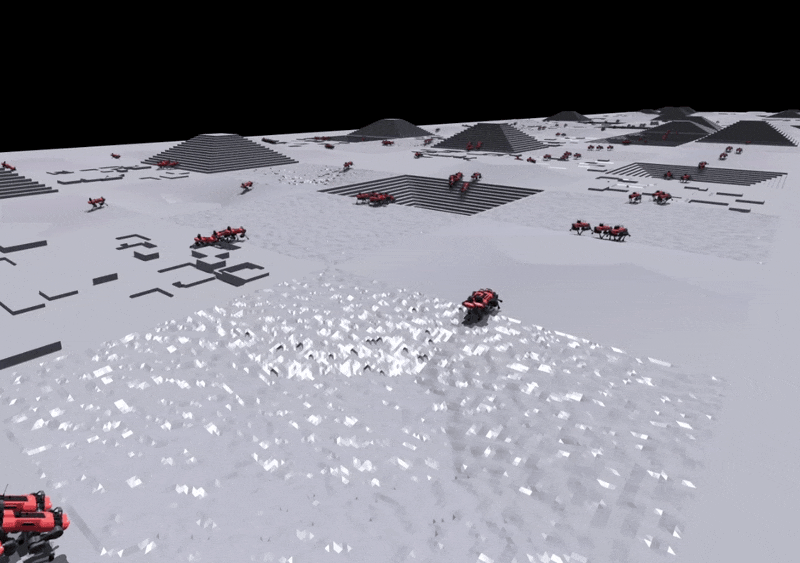

# Simulated Quadrupeds Dataset & Scripts from [BAMS](https://multiscale-behavior.github.io/)
This is a fork of the [legged_gym project](https://leggedrobotics.github.io/legged_gym/)
that uses  NVIDIA's Isaac Gym. 
It was modified to enable the generation of simulated quadrupeds data along with labeled ground truth, to enable the evaluation of [multi-scale behavior analysis](https://multiscale-behavior.github.io/) methods.


⬇️ Download the Simulated Quadrupeds Dataset [here](https://drive.google.com/file/d/1q0a6etvda3XJ498lkDdfpbkz6zGqYXAs/view?usp=sharing).



## 🤖 Dataset Details

### Why this dataset?
Simulation-based data collection enables access to information that is generally
inaccessible or hard to acquire in a real-world setting. Unlike noisy measurements coming from the
camera-based feature extractor, physics engines do not suffer from
the problem of noise. Instead, they provide accurate ground-truth information about the creature and
the world state free of charge. Access to such information is at times critical for scrutinizing the
capabilities of the learning algorithms.


### Simulation details 
We record a total of 5182 trajectories. 2756 were generated for robots of type
ANYmal B and 2426 sequences were generated for robots of type ANYmal C. These are quadruped
robots, which means that they have four legs. Each leg has 3 degrees of freedoms - hip, shank and
thigh. The position and velocities of these degrees of freedom for all 4 legs were recorded. This
results in 24 features for each robot. Robots are generated while traversing an procedurally generated
environment with different terrain types and traversal difficulty. We only keep
trajectories that correspond to a successful traversal.

### Recorded labels:
- **Robot type**: the robot can either be of type "ANYmal B" or "ANYmal C". These robots
have the same degrees of freedom and tracked joints but differ by their morphology. This is
a sequence-level task.
- **Linear velocity**: the command of the robot is a constant velocity vector. The amplitude
of the velocity dictates how fast the robot is commanded to traverse the environment. A
higher velocity would translate into more clumpsy and more risk-taking behavior. This is a
sequence-level task.
- **Terrain type**: the environment is generated with multiple segments of five terrain types
that are categorized as: flat surfaces, pits, hills, ascending and descending stairs. This is a
frame-level task.
- **Terrain slope**: the slope of the surface the robot is walking on. This is a frame-level task.
- **Terrain difficulty**: the different terrain segments have different difficulty levels based on
terrain roughness or steepness of the surface. This is a frame-level task.


## ⚙️ Using  our scripts to generate your own data
If you are looking to generate your own data, please follow the instructions below.

### Installation
Please refer to the [legged_gym](https://github.com/leggedrobotics/legged_gym) repo
for installation instructions.

### Usage
1. Training RL policy: Follow [instructions](https://github.com/leggedrobotics/legged_gym) to train
your own policy, or use our pretrained policies that can be found in the `logs/` folder.
2. Generating data: We provide a script to generate data from a trained policy. The script 
can be run with the following command:
    ```
    python generate_data.py --task=<task_name> --target_vel=<target_velocity> --output=<output_file>
    ```
    - Changing the `task_name` will change the robot morphology, while `target_velocity` will change the velocity
    with which the robot traverses the terrain. 
    - Each time the script is run, a new random terrain will be generated.
    - Note that higher velocities will result in more instability (robots falling), 
    and thus less "valid" data will be generated. Simply run this script multiple times 
    as needed if you are looking to get balanced data.
    - By default, the loaded policy is the last model of the last run of the experiment folder, meaning that if you do not 
    train your own model, our provided pretrained models will be used.

    Examples:
    ```
    python generate_data.py --task=anymal_c_rough --target_vel=1.0 --output=./data/anymal_c_vel_1.0_01.npy
    ```
    ```
    python generate_data.py --task=anymal_b --target_vel=1.0 --output=./data/anymal_b_vel_1.0_01.npy
    ```
3. Combining data: The generated data can be combined using the `combine_files_and_prepare_data.py` script:
    ```
    python combine_files_and_prepare_data.py
    ```
    

### Advanced Usage
1. Adding new terrains: Terrains are defined in `legged_gym/utils/terrain_utils.py`.
Terrains are defined based on a height map, and can be controled using user-defined 
parameters.
2. Terrain sampling: the proportion of each terrain type can be changed by modifying 
`env_cfg.terrain.terrain_proportions` in `generate_data.py`.

## 📕 Citation

If you find the dataset and/or code useful for your research, please consider citing our work:
```
@inproceedings{azabou2023relax,
    title={Relax, it doesn{\textquoteright}t matter how you get there: A new self-supervised approach for multi-timescale behavior analysis},
    author={Mehdi Azabou and Michael Jacob Mendelson and Nauman Ahad and Maks Sorokin and Shantanu Thakoor and Carolina Urzay and Eva L Dyer},
    booktitle={Thirty-seventh Conference on Neural Information Processing Systems},
    year={2023},
    url={https://openreview.net/forum?id=RInTOCEL3l}
}
 ```
and the original `legged_gym` work:
```
@inproceedings{rudin2022learning,
  title={Learning to walk in minutes using massively parallel deep reinforcement learning},
  author={Rudin, Nikita and Hoeller, David and Reist, Philipp and Hutter, Marco},
  booktitle={Conference on Robot Learning},
  pages={91--100},
  year={2022},
  organization={PMLR}
}
```